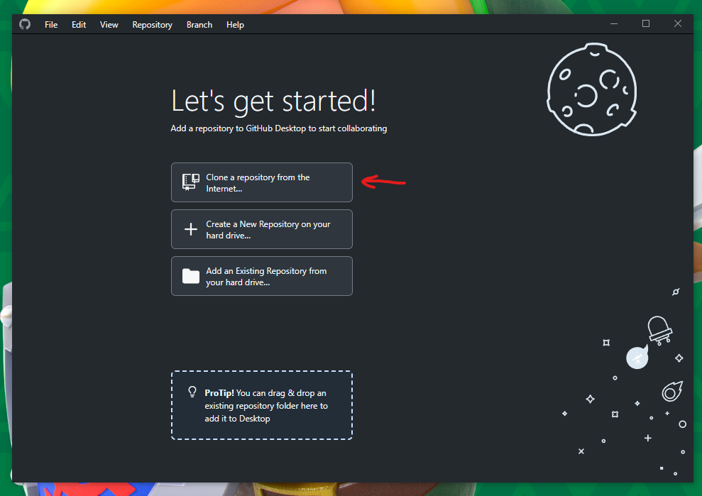
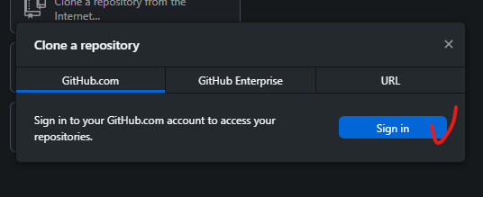
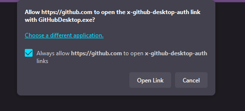
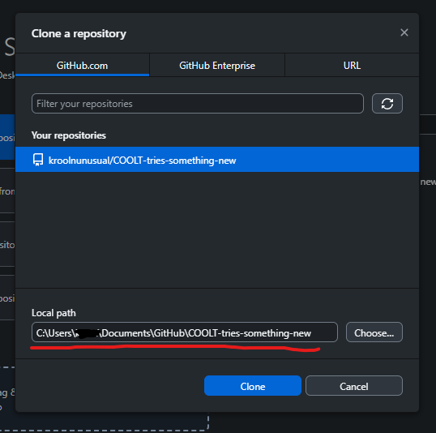
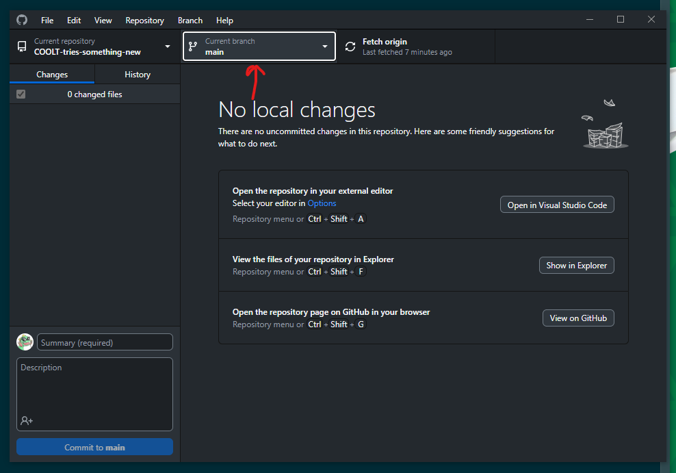
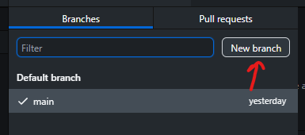
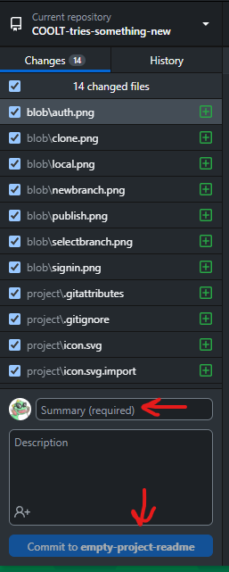
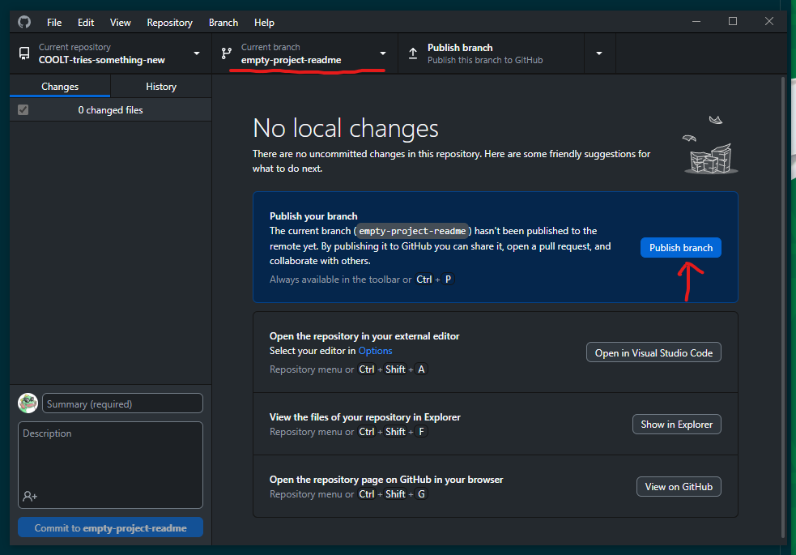

# COOLT-tries-something-new
The COOLT does a game jam!

Design documentation and assets can be found in the repository's wiki tab.

## GETTING STARTED WITH GITHUB

After signing up, ping the jam thread and we'll add you as a contributor.

Download [github desktop](https://desktop.github.com/) and go through the following steps to get a copy of the project:

You want to clone from the internet...

...signin to Github.com...

...and approve the app link so that you can use web sign in.

You should have the option to clone COOLT-tries-something-new. Make sure you take note of where the project is stored locally, and change it if the default doesn't work for you.

That's it! You should now have a local copy of the project at the location from the last step.

## CONTRIBUTING WORK

Github, and the underlying tool Git, use a "branch" model to manage splitting work. Each branch is essentially a separate copy of the project's file system. "main" is the standard branch; it's the one that we use to create new branches for work, and it's the one that our work branches go back to once we're finished. In that way, our "main" branch will build up over time into a completed app!

When you want to do new work, click the branch selector...

...open a new branch...

...and try to name it something short but descriptive of the work being done. specific-new-enemy-name for instance.

Once you're done with your work in Godot, return to github desktop.

You'll have your changes highlighted in the sidebar. You have to add a short summary of the changes, and then "commit" them to your branch as a finalization process

After 1 or multiple commits, you'll be able to hit the publish button to have your work sent to the repo!
